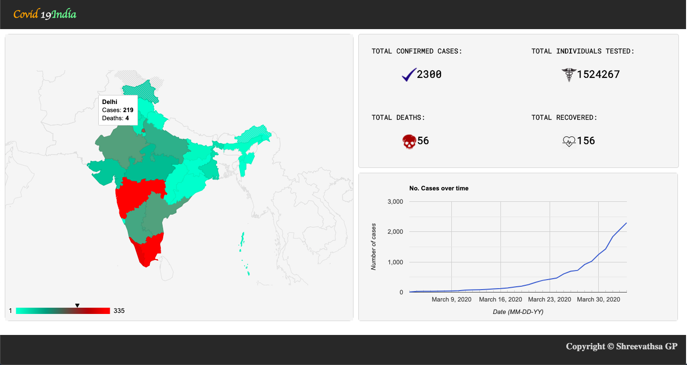
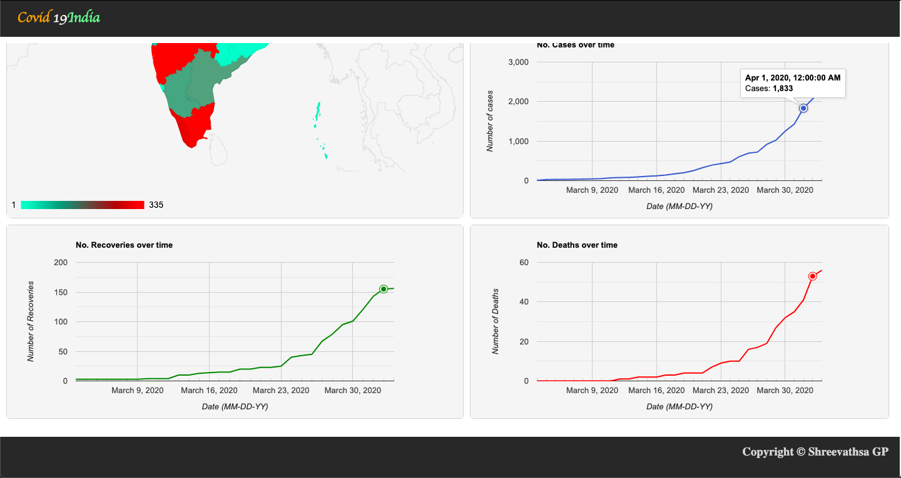

# Covid_India

<h2 align='center'><strong>Covid-19 Live Tracker for India</strong></h2>
<em>Here is the link to the website (might be shut down after the epidemic passes!) --> <a href='https://covid-india19.herokuapp.com/#chart_div_3'>covid-india19.herokuapp.com</a></em> 
 
This website provides the users with: 
<ol type="1">
   <li>The total numbers in India, including the total cases, deaths, recovered and tested.</li>
   <li>The number of cases and deaths in each state effected in India, with a geograph for visual aid.</li>
   <li>Three graphs that model:</li>
   <li type='none'>
      <ul style="list-style-type:circle;">
         <li>The increase in cases since first case</li>
         <li>The increase in deaths since first case</li>
         <li>The increase in recovereies since first case</li>
      </ul>
   </li>
</ol>
 
This web application utilizes:
<ul type='square'>
   <li>Python for scraping information from the government site, for hourly updates of statistics --> <a href='scrape.py'>scrape.py</a></li>
   <li>HTML & CSS for the front-end design of the website --> <a href='templates'>templates</a></li>
   <li>Javascript for the different graphs in the website and recieving information from Pythonb back-end --> <a href='templates/index.html'>index.html</a></li>
</ul>
 
Screenshots of web application:

